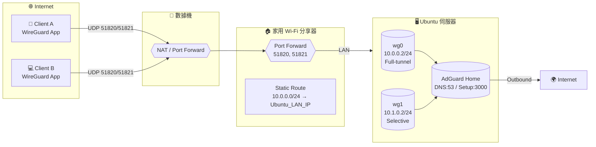

# Self-Hosted-WireGuard-VPN-with-AdGuard-Home
一個自架於 Ubuntu 上的安全 VPN 專案，整合 WireGuard、AdGuard Home 與流量分流設定

---

## 🌐 專案簡介

這個專案展示如何在 Ubuntu 上自行架設 WireGuard VPN，並透過 AdGuard Home 實現全域 DNS 過濾。  
同時支援：
- **wg0**：全流量 VPN（Full Tunnel）
- **wg1**：限定網站（例如 YouTube）分流
- **AdGuard Home 整合**：過濾廣告與追蹤器

---
## 🧩 系統架構
> 拓樸：數據機(Port 51820/51821 轉發) → 家用 Wi‑Fi 分享器(同埠 Port Forward) → 靜態路由 10.0.0.0/24 → Ubuntu (WireGuard wg0/wg1 + AdGuard Home)

### Mermaid 圖（可複製到 `docs/architecture.mmd`，或在 GitHub 上直接顯示）


### ASCII 備用圖
```
[Client A/B]
   |  UDP 51820/51821
[數據機 Modem]
   |  Port Forward 51820/51821
[家用 Wi‑Fi 分享器]
   |-- Port Forward 51820/51821 → Ubuntu
   |-- Static Route: 10.0.0.0/24 → Ubuntu_LAN_IP
[Ubuntu]
   |-- WireGuard: wg0(10.0.0.2/24, Full) / wg1(10.1.0.2/24, Selective)
   |-- AdGuard Home: DNS:53, Setup:3000
   |-- NAT → Internet
```

### 關鍵設定節點
- **數據機**：將 UDP **51820/51821** 轉發到家用路由器 WAN。
- **家用路由器**：
  - 再次將 **51820/51821** 轉發到 **Ubuntu 的 LAN IP**。
  - 新增 **靜態路由**：`10.0.0.0/24 → Ubuntu_LAN_IP`（讓內部網段能回到 Ubuntu 再由 VPN/NAT 出口）。
- **Ubuntu**：
  - `wg0` 提供全流量；`wg1` 提供指定服務分流。
  - AdGuard Home 作為 VPN 客戶端 DNS（`10.0.0.1`）。

---

## ⚙️ 技術環境

| 元件 | 說明 |
|------|------|
| OS | Ubuntu 22.04 LTS |
| VPN | WireGuard |
| DNS | AdGuard Home |
| 管理 | systemd, iptables |
| 自動化 | bash scripts |
| 多使用者 | Public/Private Key + QRCode |
---

---

## 🧱 防火牆與路由設置

自動建立以下 iptables 規則：

```bash
# 啟用 IP 轉送
sudo sysctl -w net.ipv4.ip_forward=1

# NAT 轉換
sudo iptables -t nat -A POSTROUTING -o eth0 -j MASQUERADE

# VPN 流量轉發
sudo iptables -A FORWARD -i wg0 -j ACCEPT
sudo iptables -A FORWARD -o wg0 -j ACCEPT
```
---

## 🧰 常用指令

| 指令 | 說明 |
|------|------|
| `sudo wg` | 查看目前 VPN 狀態 |
| `sudo wg-quick up wg0` | 啟動 VPN wq0 |
| `sudo wg-quick down wg0` | 關閉 VPN wq0 |
| `sudo wg show` | 顯示目前連線客戶端 |
---
